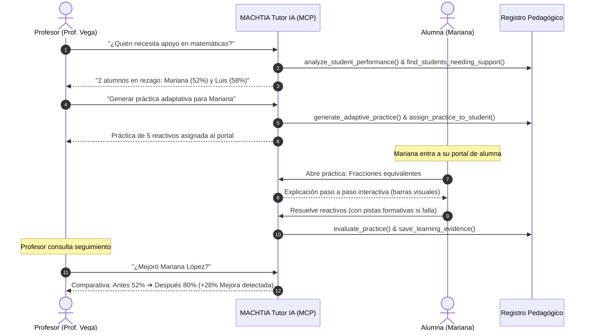

# MACHTIA Adaptive Tutor 🤖📚
> **Tutor IA Educativo Adaptativo • MVP para Hackathon Amazon / Alexa+ & Nebius / NVIDIA**


---

## 1. Qué es MACHTIA Adaptive Tutor

**MACHTIA Adaptive Tutor** es un sistema de tutoría educativa inteligente basado en agentes de IA y compatible con el protocolo **Model Context Protocol (MCP)**. 

Conecta de manera fluida el ecosistema pedagógico:
```
Profesor ➔ Tutor IA Orquestador ➔ Alumno ➔ Evidencia de Aprendizaje Medible
```

Permite a los docentes supervisar grupos escolares, diagnosticar patrones de error individuales en tiempo real, prescribir prácticas interactivas con ajuste dinámico de dificultad y comprobar el progreso cuantitativo (**Antes vs. Después**) de cada estudiante.

---

## 2. Problema que Resuelve

1. **Atención a la diversidad en aulas masivas:** En clases de 30 o más alumnos, un profesor no cuenta con el tiempo para generar 5 ejercicios específicos dirigidos a la brecha conceptual particular de cada alumno con rezago.
2. **Chatbots genéricos no pedagógicos:** Los chatbots convencionales simplemente dan la respuesta directa o arrojan textos largos que el niño no comprende.
3. **Falta de evidencia formativa medible:** Las herramientas existentes no vinculan la evaluación diagnóstica inicial con la práctica interactiva ni demuestran el delta de mejora post-intervención.

**La Solución de MACHTIA:**
Un agente que no solo responde preguntas, sino que ejecuta herramientas diagnósticas, genera representaciones gráficas interactivas (fracciones visuales de chocolate), brinda pistas formativas sin regalar la respuesta, y registra la evidencia oficial de impacto (+28% de progreso).

---

## 3. Flujo Profesor - Alumno



---

## 4. Arquitectura del Agente

El sistema cuenta con una arquitectura modular y limpia, diseñada para desacoplar la interfaz de usuario de las herramientas de inferencia y almacenamiento:

```
├── app/                      # Rutas Next.js App Router (layout, page, estilos)
├── components/               # Componentes UI compartidos (Navbar, FractionBarVisualizer)
├── features/
│   ├── teacher/              # Módulo Profesor: Dashboard, Tutor IA, Grupo, Rezago, Evidencias
│   └── student/              # Módulo Alumno: Home, Prácticas, Runner Interactivo, Chat
├── lib/
│   ├── ai/
│   │   ├── tutor-agent.ts    # Orquestador del Agente y ejecutor de telemetría
│   │   └── providers.ts      # Abstracción de proveedores (Mock, Bedrock, Nebius)
│   ├── tools/
│   │   └── tutor-tools.ts    # Capa de 12 Herramientas compatibles con MCP
│   ├── data/
│   │   ├── mock-data.ts      # Banco inicial de datos de Grupo 3° B y reactivos
│   │   └── repository.ts     # Repositorio con persistencia y control de estado
│   └── context/
│       └── tutor-context.tsx # React Context con alternancia instantánea de roles
├── types/                    # Interfaces TypeScript del dominio pedagógico
├── tests/                    # Pruebas unitarias automatizadas con Vitest
└── docs/                     # Guion de demo (HACKATHON_DEMO.md)
```

---

## 5. Herramientas Disponibles (Capa MCP)

El agente dispone de 12 herramientas compatibles conceptual y estructuralmente con el protocolo **Model Context Protocol (MCP)**:

| Herramienta | Descripción MCP |
|---|---|
| `analyze_student_performance` | Analiza el desempeño del grupo e identifica temas con mayor rezago curricular. |
| `find_students_needing_support` | Filtra alumnos con calificación inferior al umbral configurable (ej. 65%). |
| `get_student_learning_gap` | Diagnostica la causa raíz y el error recurrente específico del estudiante. |
| `generate_adaptive_practice` | Construye una batería de 5 ejercicios adaptados al patrón de error detectado. |
| `assign_practice_to_student` | Publica la práctica generada directamente en la vista del alumno. |
| `explain_concept` | Genera una explicación multi-paso con analogías visuales adaptadas a la edad. |
| `evaluate_answer` | Calibra respuestas, ofreciendo pistas en el primer fallo y explicación formativa en el segundo. |
| `adapt_difficulty` | Ajusta la dificultad hacia arriba o hacia abajo en tiempo real según el desempeño del alumno. |
| `evaluate_practice` | Totaliza aciertos, porcentaje y categoriza conceptos dominados vs pendientes. |
| `save_learning_evidence` | Registra formalmente el delta comparativo de impacto pedagógico. |
| `get_student_progress` | Consulta el histórico de evolución académica del alumno. |
| `report_progress_to_teacher` | Sintetiza el reporte de mejora para respuesta ejecutiva al docente. |

---

## 6. Cómo Ejecutar

### Prerrequisitos
- Node.js 18+ (recomendado Node 20 o 22)
- npm o pnpm

### Pasos de Instalación y Ejecución

```bash
# 1. Instalar dependencias
npm install

# 2. Ejecutar suite de pruebas unitarias
npm test

# 3. Validar tipos TypeScript
npm run typecheck

# 4. Validar linter
npm run lint

# 5. Compilar versión de producción
npm run build

# 6. Iniciar servidor de desarrollo
npm run dev
```

Abre en tu navegador:  
👉 **`http://localhost:3000`**

---

## 7. Cómo Integrar Posteriormente Amazon Alexa+ / MCP

La arquitectura fue construida para integrarse con **Amazon Alexa+** y **AWS Bedrock**:

1. **Exposición como Servidor MCP:**
   - La capa `lib/tools/tutor-tools.ts` exporta `MCP_TOOLS_REGISTRY` con esquemas JSON Schema estándar.
   - Basta con levantar un transporte MCP stdio o SSE (`@modelcontextprotocol/sdk`) que envuelva estas funciones.
2. **Integración con Alexa+ Skills:**
   - En Alexa Developer Console, configurar una Skill de tipo *Custom Voice Agent*.
   - El endpoint Lambda de la Skill invoca `tutorAgent.processTeacherQuery(alexaUtterance)`.
   - Soporta comandos de voz directos como:  
     *“Alexa, pregunta a MACHTIA quién necesita apoyo en mi salón de tercero de primaria”*.
3. **AWS Bedrock:**
   - Reemplazar `MockAIProvider` en `lib/ai/providers.ts` por el adapter `AmazonAIProvider` conectado a `BedrockRuntimeClient` con modelos como Claude 3.5 Sonnet o Amazon Nova.

---

## 8. Cómo Adaptar Posteriormente a Nebius / NVIDIA

1. **Inferencia en Nebius AI Studio:**
   - Configurar la variable de entorno `NEBIUS_API_KEY` en el archivo `.env.local`.
   - `NebiusAIProvider` utiliza el cliente estándar OpenAI-compatible apuntando a `https://api.studio.nebius.ai/v1`.
2. **Aceleración con NVIDIA NIM Microservices:**
   - Para despliegue local o privado en servidores con GPUs NVIDIA, levantar contenedores NIM de modelos abiertos (ej. Llama 3.1 70B Instruct).
   - Apuntar el endpoint de inferencia al microservicio local de NVIDIA NIM (`http://localhost:8000/v1`), manteniendo intacta la lógica de las 12 herramientas MCP.

---

## 📋 Datos Demo Incluidos

- **Grupo:** 3° B Primaria (5 alumnos)
- **Materia:** Matemáticas
- **Tema:** Fracciones equivalentes
- **Alumnos con rezago:**
  - **Mariana López:** Promedio 8.1 • Fracciones 52% • Error: Comparación de denominadores
  - **Luis Hernández:** Promedio 7.8 • Fracciones 58% • Error: Simplificación
- **Alumnos con desempeño óptimo:** Sofía Martínez (95%), Diego Ramírez (84%), Valeria Torres (88%)
- **Resultado post-práctica de Mariana:** **52% ➔ 80% (+28% Mejora detectada)**

---

**MACHTIA** • *Inteligencia Educativa para todos los niños y niñas.*
