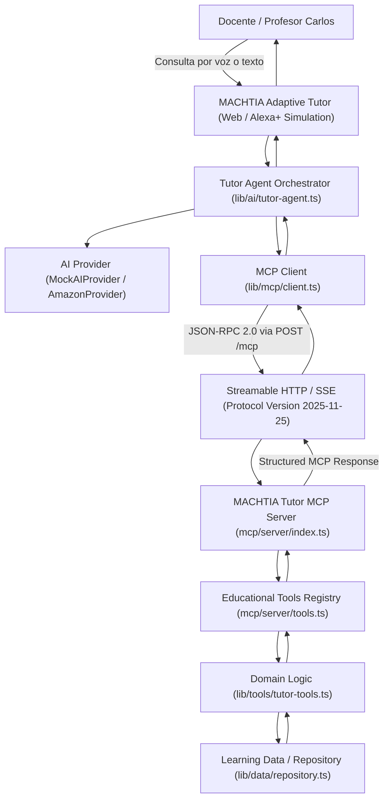

# Arquitectura MCP y Amazon Alexa+ en MACHTIA Adaptive Tutor

Este documento detalla la arquitectura de integración técnica entre **MACHTIA Adaptive Tutor**, el protocolo estándar de la industria **Model Context Protocol (MCP)** versión `2025-11-25`, y la pista **Amazon Alexa+** del Amazon Developer Hackathon.

---

## 1. Diagrama de Arquitectura End-to-End



---

## 2. Componentes del Ecosistema

### 2.1. Interfaz de Usuario y Simulación Alexa+
- **Experiencia conversacional:** Permite al profesor interactuar mediante lenguaje natural (ej. *"¿Quién necesita apoyo en matemáticas?"*, *"Ver brecha de Mariana López"*, *"Crear práctica de apoyo"*).
- **Indicador discreto Alexa+:** Identifica la experiencia como una simulación de habilidades para Alexa+ sin perder la identidad visual de MACHTIA.
- **Diferenciación de actividad:** Los eventos se desglosan en 4 niveles observables:
  - `AGENT`: Estado u objetivo cognitivo del orquestador.
  - `MCP`: Estado del canal de comunicación (Streamable HTTP 2025-11-25).
  - `TOOL`: Herramienta pedagógica invocada con sus parámetros exactos.
  - `RESULT`: Resultado estructurado entregado por la herramienta.

### 2.2. Tutor Agent Orchestrator (`lib/ai/tutor-agent.ts`)
- Coordina el razonamiento y la secuenciación pedagógica.
- Despacha las herramientas a través de `McpClient`.
- Emite registros auditables a la telemetría del profesor.

### 2.3. MCP Client (`lib/mcp/client.ts`)
- Implementa cliente HTTP estándar compatible con MCP 2025-11-25.
- Realiza handshakes periódicos (`initialize`, `ping`) para comprobar la disponibilidad del servidor.
- **Resiliencia y Fallback:** Si el servidor MCP externo no está disponible (ej. offline en entorno local sin levantar el puerto 3100), el cliente conmuta automáticamente a la ejecución local controlada (`source: "local-fallback"`), asegurando que el profesor y el alumno nunca experimenten interrupciones ni pantallas de error.

### 2.4. Servidor MCP Ejecutable (`mcp/server/index.ts`)
- Servidor HTTP independiente en Node.js que expone las herramientas educativas de MACHTIA al ecosistema de agentes.
- **Protocolo:** MCP `2025-11-25`.
- **Transporte:** Streamable HTTP con soporte SSE para streaming y endpoints:
  - `POST /mcp`: Endpoint principal JSON-RPC 2.0 (`initialize`, `tools/list`, `tools/call`, `ping`).
  - `GET /mcp`: Canal de Server-Sent Events (SSE) con heartbeat y notificaciones.
  - `GET /health`: Monitor de salud y métricas de herramientas expuestas.

### 2.5. Herramientas MCP Expuestas
El servidor MCP publica 7 herramientas fundamentales con schemas formales en JSON Schema:

| Nombre de la Herramienta | Schema de Entrada | Salida Estructurada |
|---|---|---|
| `analyze_student_performance` | `{ groupId, subjectId }` | Métricas grupales, promedios por tema y detección de tema crítico. |
| `find_students_needing_support` | `{ groupId, subjectId?, threshold? }` | Lista de alumnos con rezago, calificación, materia y evidencia empírica. |
| `get_student_learning_gap` | `{ studentId, subjectId?, topicId? }` | Causa raíz del error recurrente y evidencia diagnóstica. |
| `generate_adaptive_practice` | `{ studentId, topicId, initialDifficulty?, exerciseCount? }` | Batería de 5 reactivos con andamiaje de 3 niveles y estado `"pending"`. |
| `assign_practice_to_student` | `{ practiceId, studentId }` | Confirmación de asignación para el portal del alumno. |
| `get_student_progress` | `{ studentId, subjectId? }` | Trayectoria histórica antes vs. después. |
| `report_progress_to_teacher` | `{ studentId, practiceId?, subjectId? }` | Delta de mejora cuantitativo, conceptos dominados y pendientes. |

---

## 3. Formato de Mensajes JSON-RPC 2.0 (Streamable HTTP)

### Handshake `initialize`
```json
// Petición (POST /mcp)
{
  "jsonrpc": "2.0",
  "id": "init-01",
  "method": "initialize",
  "params": {
    "protocolVersion": "2025-11-25",
    "clientInfo": {
      "name": "machtia-adaptive-tutor-web",
      "version": "1.0.0"
    }
  }
}

// Respuesta
{
  "jsonrpc": "2.0",
  "id": "init-01",
  "result": {
    "protocolVersion": "2025-11-25",
    "capabilities": {
      "tools": { "listChanged": false }
    },
    "serverInfo": {
      "name": "machtia-tutor-mcp-server",
      "version": "1.0.0"
    }
  }
}
```

### Ejecución de Herramienta `tools/call`
```json
// Petición (POST /mcp)
{
  "jsonrpc": "2.0",
  "id": "call-02",
  "method": "tools/call",
  "params": {
    "name": "find_students_needing_support",
    "arguments": {
      "groupId": "grupo-3b",
      "subjectId": "matematicas",
      "threshold": 65
    }
  }
}

// Respuesta
{
  "jsonrpc": "2.0",
  "id": "call-02",
  "result": {
    "content": [
      {
        "type": "text",
        "text": "{ \"students\": [ ... ] }"
      }
    ],
    "structuredContent": {
      "groupId": "grupo-3b",
      "count": 2,
      "students": [
        {
          "studentId": "mariana-lopez",
          "name": "Mariana López",
          "subject": "Matemáticas",
          "topic": "Fracciones equivalentes",
          "score": 52,
          "recurringError": "Comparación de denominadores",
          "evidence": "Falló 4 de 7 reactivos de comparación..."
        }
      ]
    },
    "isError": false
  }
}
```

---

## 4. Adaptabilidad a Proveedores de IA (Amazon Bedrock y Alexa+)

La arquitectura separa estrictamente la capa de herramientas del modelo de lenguaje:
- **Modo Demo (por defecto):** Utiliza `MockAIProvider` para respuestas instantáneas, estables y sin costo durante demostraciones de hackathon, pero ejecutando herramientas MCP reales mediante Streamable HTTP.
- **Modo Amazon (`AI_PROVIDER=amazon`):** Preparado arquitectónicamente para conectarse a **Amazon Bedrock** (Anthropic Claude 3.5 Sonnet / Amazon Nova Pro) utilizando las variables de entorno estándar de AWS (`AWS_REGION`, `AWS_ACCESS_KEY_ID`, `AWS_SECRET_ACCESS_KEY`, `AWS_BEDROCK_API_KEY`). Si las credenciales no están presentes, el sistema aplica fallback automático a `MockAIProvider` sin interrumpir la ejecución.
- **Modo Nebius (`AI_PROVIDER=nebius`):** Permite reutilizar la misma interfaz para inferencias con aceleración NVIDIA NIM sobre clústeres de Nebius AI Studio.
